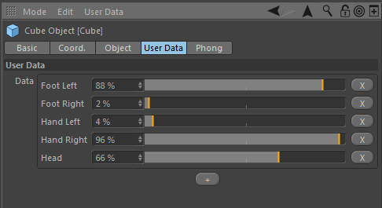

# Floatlist Custom datatype & GUI

This example implements a new datatype and UI which can be used inside
of Cinema 4D. To be more specific, the datatype is a dynamic list of
String/Float pairs that can be modified from the UI (adding, removing
and changing values).

This example involves 4 classes that must play together nicely.

### `FloatlistData`

Located in `cinema4dsdk/customgui/floatlist.h`

A subclass of the CustomDataType class which contains the
actual data that is being interchanged. You can imagine it
to be equal to the SplineData class in terms of its function.

### `FloatlistDataType`

This class implements the behavior of the FloatlistData
datatype when Cinema needs to interact with it. Not only
allocation and deallocation of the FloatlistData is managed,
but also when one `FloatlistData` needs to be copied to another
FloatlistData (see `FloatlistDataType::CopyData`).

Other tasks include reading and writing the datatype to and
from disk, comparing (lower, greater, equal), telling Cinema
what name is to be used in description resources and the
properties that can be used there, as well as telling Cinema
about the subchannels of the data.

__About subchannels__: A vector always has three subchannels
which are its components, XY and Z. The SplineData has sub-
channels for each of its knots. The Floatlist will have sub-
channel for each item in the list.

That FloatlistGui is the default UI for the FloatlistData data-
type is declared in the body of the virtual
`FloatlistDataType::GetDefaultProperties()` method.

### `FloatlistGui`

The FloatlistGui is a subclass of iCustomGui which in turn is
a SubDialog, and next, GeDialog, subclass. Its task is to
display the FloatlistGui to the user. While it is possible to
use the `SUBDESCRIPTION` custom gui which makes use of the
subchannels declared via FloatlistDataType, this custom GUI
provides enhanced user interaction as it also displays buttons
to add and remove items.

### `FloatlistGuiData`

This class manages the allocation and deallocation of the
FloatlistGui dialog and the information for the resource
parser when dialog resources are being parsed.

## Frequently Asked Questions

__Q__: How does Cinema know that the FloatlistGui should be used for
   the FloatlistData datatype?  
__A__: It is declared in `FloatlistDataType::GetDefaultProperties()`

